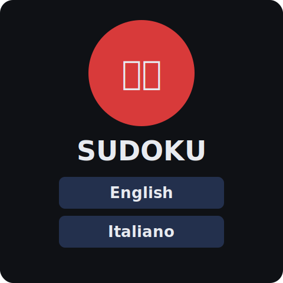
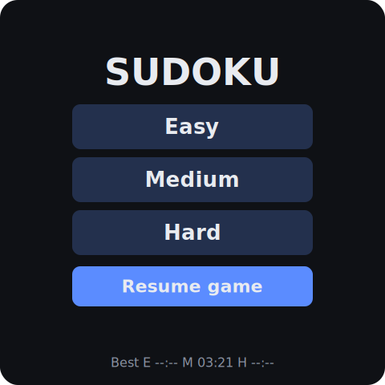
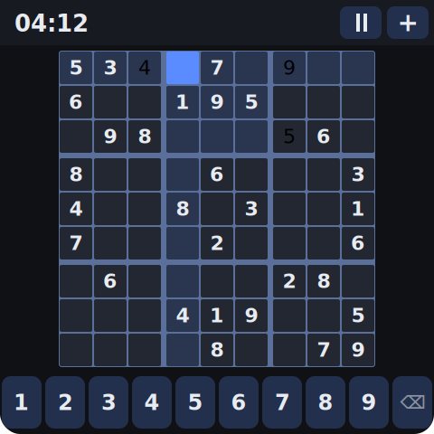
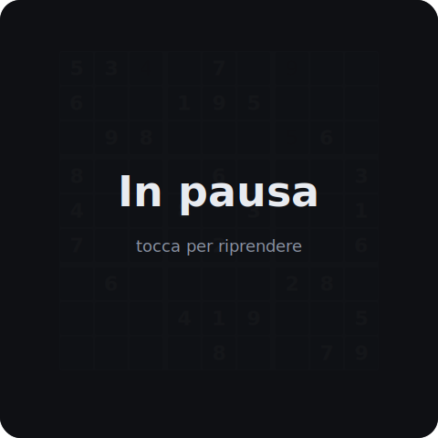
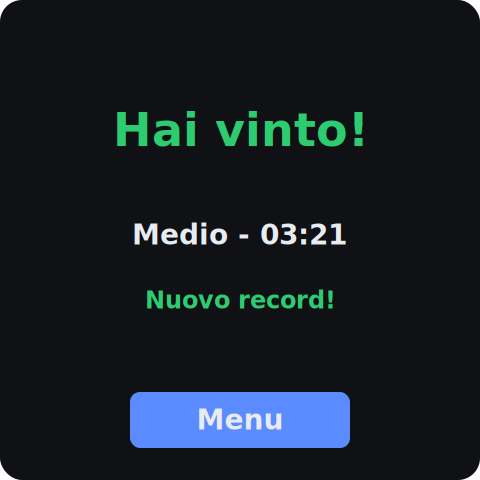

# Sudoku Panel

**English** · [Italiano](README.md)

A **Sudoku** game for the **Waveshare ESP32-S3-Touch-LCD-4** touch panel (480×480).
Random puzzles generated **on-device** with a guaranteed unique solution, a stopwatch
with pause, automatic game saving, pencil-mark notes and per-level best times — all in a
standalone firmware, with no WiFi and no cloud dependencies.

## Screens

<table>
  <tr>
    <td align="center"><br><sub><b>Splash</b> — kanji intro &amp; language pick (EN/IT)</sub></td>
    <td align="center"><br><sub><b>Menu</b> — difficulty, resume, best times</sub></td>
  </tr>
  <tr>
    <td align="center"><br><sub><b>Game</b> — 9×9 grid, keypad, notes, timer</sub></td>
    <td align="center"><br><sub><b>Pause</b> — grid dimmed, clock stopped</sub></td>
  </tr>
  <tr>
    <td align="center"><br><sub><b>Win</b> — final time and record</sub></td>
    <td></td>
  </tr>
</table>

<sub>Representative mockups of the interface (dark theme, layout C★). See
<a href="#regenerating-the-screenshots">Regenerating the screenshots</a>.</sub>

---

## Features

- 🎲 **Infinite on-device puzzles** — generated at runtime with a **guaranteed unique solution** (backtracking + uniqueness check). No pre-loaded puzzles, no repeats.
- 🎚️ **Three levels** — Easy / Medium / Hard (calibrated by number of clues).
- ✏️ **Pencil marks (notes)** — a top-bar toggle switches to notes mode; tap 1–9 to add/remove small candidate digits in the selected cell, just like real Sudoku apps.
- 🔢 **Smart keypad** — once a digit is correctly placed in all nine cells, its key greys out and stops responding.
- ⏱️ **Stopwatch** — counts only play time; stops on pause and on win.
- ⏸️ **Pause** — dims the grid and freezes the clock ("tap to resume"), so you can't peek with the timer stopped.
- 💾 **Autosave & resume** — the game is saved to NVS after every move, so an unexpected power loss won't lose your progress; on next start, picking a difficulty offers to **resume** the saved game or start a **new** one.
- 🏆 **Best times** — fastest time stored per level.
- ↩️ **Undo** and **highlighting** of the selected cell (row / column / box) and of matching numbers, in distinct colors.
- 🌐 **Bilingual UI (EN/IT)** — language chosen on the splash screen and persisted in NVS.
- 🌙 **Dark theme**, layout optimised for capacitive touch (maximised grid + fixed keypad).

## Hardware

| Component | Detail |
|---|---|
| Board | Waveshare **ESP32-S3-Touch-LCD-4** (ESP32-S3 N16R8) |
| Display | 480×480 IPS, **ST7701** controller (RGB bus) |
| Touch | **GT911** capacitive (I²C) |
| IO expander | **TCA9554** (LCD/touch reset, backlight) |
| Memory | 16 MB Flash QIO · 8 MB PSRAM OPI |

## Architecture

A clean split between **pure logic** (portable C++, tested on PC) and **firmware**
(Arduino/LVGL):

```
lib/sudoku/            engine + session (pure C++, NO Arduino/LVGL)
  sudoku_solver        backtracking solver + solution counting (uniqueness)
  sudoku_generator     full-grid generation + digging to a unique solution
  sudoku_board         grid state: givens, values, notes, undo, conflicts, win
  game_session         state machine + stopwatch + input + snapshot save/restore
src/
  main.cpp             hardware bring-up (IO expander, backlight, LVGL) + loop
  ui.cpp               LVGL UI: splash, menu, game, pause, win
  storage.cpp          NVS persistence (game + records + language), payload-validated
  i18n.cpp             minimal EN/IT string table
  lvgl_port_v8.cpp     LVGL ↔ RGB display port (from Espressif/Waveshare)
  font_eraser.c        generated LVGL font: mdi-eraser glyph
  font_jp56.c          generated LVGL font: 数独 kanji (splash)
include/               headers (config, theme, i18n, fonts, ESP_Panel board, lv_conf)
test/                  Unity unit tests for engine and session (native environment)
```

The game logic does not depend on the hardware: it runs both on the PC (for tests) and
on the device.

## Build & flash

Requires [PlatformIO](https://platformio.org/). The device build uses the **pioarduino**
fork (Arduino-ESP32 3.0.7 / ESP-IDF v5.1), required by `ESP32_Display_Panel`.

```bash
# Build the firmware
pio run -e esp32-s3-touch-lcd-4

# Build and flash to the panel (USB-C)
pio run -e esp32-s3-touch-lcd-4 -t upload

# Serial monitor
pio device monitor -b 115200
```

> The first build downloads the toolchain (~200 MB) and can take several minutes;
> later builds are around ~2 minutes.

## Test (on PC, no hardware)

The engine and session are covered by **Unity** unit tests that run natively:

```bash
pio test -e native
```

You need a host C++ compiler on the PATH (e.g. MinGW-w64 / `g++`).

## Controls

| Action | Touch |
|---|---|
| Choose difficulty | menu buttons |
| Select a cell | tap the cell |
| Enter a number | keys `1`–`9` on the keypad |
| Erase | eraser key (⌫) |
| Toggle notes mode | pencil button in the top bar |
| Pause | ⏸ in the top bar |
| Back to menu | **MENU** in the top bar |
| Resume after pause | tap the screen |

## Project structure

- `docs/design/` — design document
- `docs/plans/` — implementation plans (engine, session, firmware)
- `docs/mockups/` — HTML mockups of the layouts explored during design (chosen layout: **C★**)
- `docs/images/` — SVG mockups of the screens (see [Screens](#screens)), generated by `scripts/gen_mockups.py`
- `scripts/gen_mockups.py` — regenerates the screen mockups (see below)
- `scripts/gen_fonts.md` — how the generated LVGL fonts (`font_eraser`, `font_jp56`) are produced with `lv_font_conv`
- `scripts/sermon.py` — "bounded" serial-monitor capture (handy for debugging)

## Regenerating the screenshots

The screenshots in [Screens](#screens) are **vector mockups**, not device captures. They
are produced by a small Python script that mirrors the real palette
([`include/ui_theme.h`](include/ui_theme.h)) and layout ([`src/ui.cpp`](src/ui.cpp)):

```bash
python scripts/gen_mockups.py
```

This rewrites `docs/images/{splash,menu,game,pause,win}.svg` in place. When the UI
changes (colors, layout, labels), update the palette/layout constants at the top of
[`scripts/gen_mockups.py`](scripts/gen_mockups.py) and re-run it. (For true device
captures, take a screenshot from the panel and drop the PNGs into `docs/images/`,
updating the links above.)

## License

Project code released under the **MIT** license — see [LICENSE](LICENSE).

The display porting layer (`src/lvgl_port_v8.cpp`, `include/lvgl_port_v8.h`,
`include/ESP_Panel_*.h`) derives from the Espressif/Waveshare examples and is subject to
their respective licenses (CC0-1.0 / Apache-2.0) noted in the file headers.
[LVGL](https://lvgl.io) is distributed under the MIT license. The generated fonts derive
from Material Design Icons (Apache-2.0) and a Japanese font (e.g. Noto Sans JP, SIL OFL).
